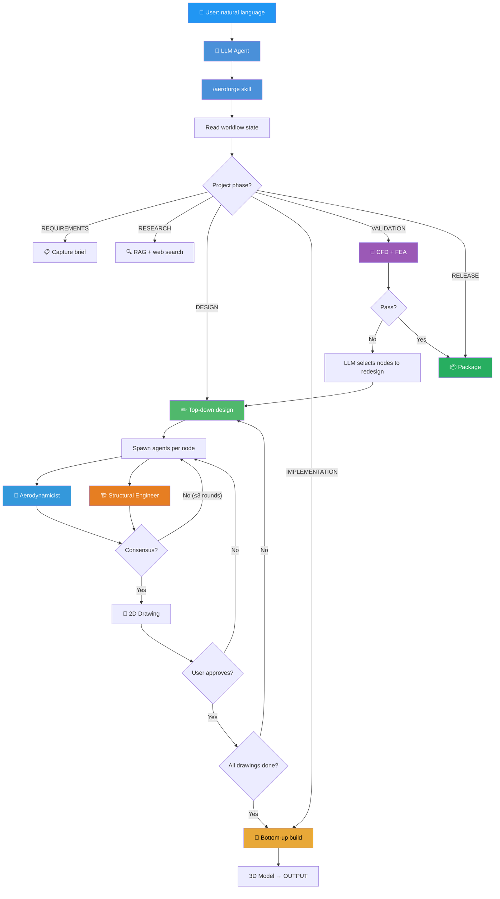
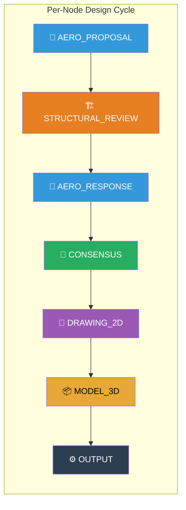
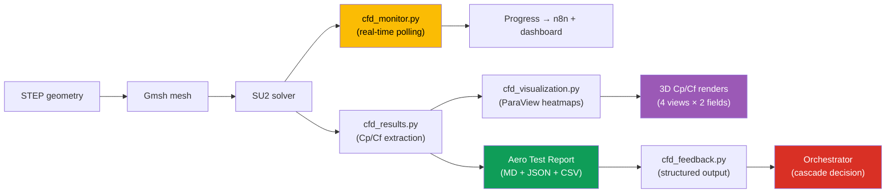

# AeroForge

**AI-autonomous design framework for heavier-than-air aircraft.**

AeroForge runs inside any LLM agent (Claude Code, Codex, etc.) as an autonomous
design assistant. The LLM drives the workflow; a deterministic engine enforces
quality gates, step sequencing, and validation. The user gives design direction
in natural language — the system handles everything else.

Not limited to one aircraft class, manufacturing method, or deliverable type.
Paper airplane to interceptor drone — same framework, different providers.

## How It Works



## Architecture

### Hierarchical Node Tree

Every component and assembly has its own design cycle. The workflow is a
recursive tree, not a flat list.



| Node Type | Design Cycle | Examples |
|-----------|-------------|----------|
| **component** | Full 7-step cycle | Wing panel, elevator, fuselage section |
| **assembly** | Full 7-step cycle | Wing assembly, H-stab assembly, the whole aircraft |
| **off_shelf** | None | Servo, battery, carbon rod, screw |

### Project Phases (top level)

```
REQUIREMENTS → RESEARCH → DESIGN → IMPLEMENTATION → VALIDATION → RELEASE
```

- **DESIGN gate**: All nodes must have approved 2D drawings before IMPLEMENTATION
- **IMPLEMENTATION order**: Leaves first (components), then assemblies, bottom-up
- **VALIDATION**: CFD + FEA on assembled top object only
- **Validation cascade**: LLM decides which nodes to redesign based on results

### Provider System

Swappable backends for analysis and manufacturing:

| Category | Level | Examples |
|----------|-------|---------|
| CFD | System | SU2 (CUDA), SU2 (CPU), mock |
| FEA | System | FreeCAD+CalculiX, mock |
| Airfoil | System | NeuralFoil, mock |
| Manufacturing | Project | FDM, manual, CNC, laser |
| Slicer | Project | OrcaSlicer, PrusaSlicer, mock |

System providers depend on local hardware (auto-detected).
Project providers depend on what's being built.

### Multi-Project Support

```
aeroforge/
├── src/                    # Framework (shared)
├── config/                 # System providers
├── projects/
│   ├── air4-f5j/           # F5J thermal sailplane
│   │   ├── aeroforge.yaml  # Project config + providers
│   │   ├── cad/            # Components + assemblies
│   │   └── docs/           # Project-specific docs
│   └── (your-project)/     # Created via /aeroforge-init
```

## Usage

AeroForge runs as a Claude Code skill. No CLI commands needed.

```
/aeroforge-init    → Initialize a new project (interactive)
/aeroforge         → Drive the active project's workflow
```

The LLM reads project state, spawns design agents, updates workflow steps,
and shows you deliverables for approval. You give design direction in
natural language.

## Agents

| Agent | Role | When |
|-------|------|------|
| Aerodynamicist | Airfoil, planform, performance | Design phase |
| Structural Engineer | Mass, strength, manufacturability | Design phase |
| Wind-Tunnel Engineer | SU2 CFD analysis | Validation phase |
| Structures Analyst | FreeCAD FEA analysis | Validation phase |

All agents are generic — they read project config at runtime to adapt
to the aircraft type, materials, and manufacturing technique.

## Quality Enforcement

13 deterministic hooks run automatically on every tool call:

- **workflow_step_guard**: Blocks work outside the active step
- **aero_consensus_check**: Blocks drawings without design consensus
- **cad_structure_validate**: Enforces folder hierarchy and naming
- **complexity_check**: Warns against unjustified simplification
- **assembly_validate**: Blocks collisions and protrusions

## Documentation

- [Framework docs](docs/framework/README.md) — workflow, initialization, components
- [Workflow model](docs/framework/workflow.md) — phases, iteration, validation

## CFD/FEA Validation Pipeline

The VALIDATION phase runs full-aircraft CFD and FEA on the assembled top object.
The pipeline is fully instrumented:



| Module | Purpose |
|--------|---------|
| `cfd_results.py` | Parse SU2 output, compute stability derivatives, drag breakdown, generate Aero Test Report |
| `cfd_monitor.py` | Poll SU2 residuals during execution, report progress + ETA, detect divergence |
| `cfd_visualization.py` | ParaView 3D heatmaps (Cp/Cf), matplotlib fallback |
| `cfd_feedback.py` | Structured pass/fail output for the orchestrator — no node/hierarchy knowledge |

Hard-stop validation: missing outputs block step completion. Every run produces
polars, stability derivatives, drag breakdown, heatmaps, and convergence diagnostics.

## Testing

```bash
cd D:/Repos/aeroforge && PYTHONPATH=. python -m pytest tests/ -q
```

285+ tests covering: providers, project management, workflow iteration,
telemetry, BOM sync, RAG context, CFD result extraction, progress monitoring,
heatmap rendering, iteration feedback, separation of concerns.
