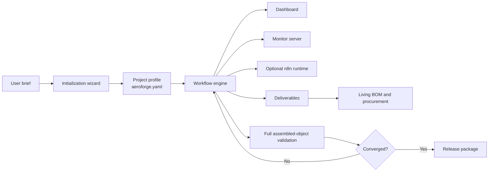

# AeroForge

**AeroForge is a generic AI-guided design framework for heavier-than-air flying
objects.**

It is not limited to one aircraft class, one manufacturing method, or one
deliverable type. A project starts from a user brief, captures upstream
decisions such as aircraft/body class, tooling, manufacturing technique,
material strategy, and output artifacts, then runs a strict staged workflow
with visible progress, hooks, and living BOM/procurement synchronization.

The current repository includes `AIR4`, an electric thermal sailplane, as the
main example project. That project is an example implementation, not the
definition of the framework itself.

## System Overview

## What AeroForge Does

- captures a project brief for a heavier-than-air flying object
- records non-deterministic project choices through a wizard and project profile
- enforces deterministic workflow sequencing and dependency ordering
- shows the active step through a dashboard, hooks, and optional `n8n`
- treats deliverables, BOM state, and procurement state as living artifacts
- runs final aerodynamic and structural validation on the assembled top object

## Core Concepts

- `Project profile`: the persisted contract between upstream reasoning and the
  deterministic engine
- `Component`: the lowest tracked part, either custom or off-the-shelf
- `Assembly`: any parent object made from components and/or lower assemblies
- `Deliverable`: the expected artifact from a node or stage
- `Workflow round`: a tracked iteration label for top-level or local refinement

Canonical framework docs live under [docs/README.md](docs/README.md).

## Standing Workflow

The framework uses a top-down first, drill-down second, bottom-up refresh loop.
Every tracked node follows the same staged sequence:

`REQUIREMENTS -> RESEARCH -> AERO_PROPOSAL -> STRUCTURAL_REVIEW -> AERO_RESPONSE -> CONSENSUS -> DRAWING_2D -> MODEL_3D -> MESH -> VALIDATION -> RELEASE`

See:

- [Workflow model](docs/framework/workflow.md)
- [Initialization and project profile](docs/framework/initialization-and-profile.md)
- [Monitoring, hooks, and n8n](docs/framework/monitoring-hooks-and-n8n.md)
- [Living BOM and procurement](docs/framework/bom-and-procurement.md)

## Documentation Map

- [Docs index](docs/README.md)
- [Framework docs](docs/framework/README.md)
- [Example project docs](docs/examples/README.md)
- [Reference and research archive](docs/reference/README.md)
- [GitHub wiki](https://github.com/ipanov/aeroforge/wiki)

## Current Example Project

`AIR4` is the current example program in this repo. It is an electric thermal
sailplane used to exercise the orchestration model, documentation model,
deliverable discipline, living BOM flow, and validation loop.

Project-specific material is grouped under:

- [AIR4 example overview](docs/examples/AIR4.md)
- `cad/assemblies/Iva_Aeroforge/`
- `cad/assemblies/wing/Wing_Assembly/`
- `cad/assemblies/fuselage/Fuselage_Assembly/`
- `cad/assemblies/empennage/HStab_Assembly/`

## Monitoring and n8n

The workflow monitor stack currently includes:

- `.claude/workflow_state.json` as the state source of truth
- `exports/workflow_dashboard.html` as the graphical status board
- the local monitor server exposed by the orchestrator CLI
- guard hooks that enforce step discipline
- optional `n8n` integration for runtime visibility and event handling

Use the framework docs for the canonical behavior description. Use the AIR4
example docs for one concrete project interpretation of that behavior.
