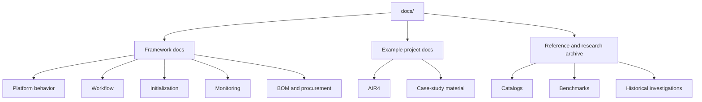

# AeroForge Documentation

This folder is the **authoritative source of truth** for AeroForge
documentation.

The docs are intentionally split into three classes so the framework stays
generic while example-project and historical material remain available.

## Documentation Classes

## Start Here

- [Framework docs](framework/README.md)
- [Example project docs](examples/README.md)
- [Reference and research archive](reference/README.md)
- [GitHub wiki](https://github.com/ipanov/aeroforge/wiki)

## Recommended Reading Paths

If you are new to AeroForge:

1. [Framework overview](framework/overview.md)
2. [Workflow and iteration model](framework/workflow.md)
3. [Initialization and project profile](framework/initialization-and-profile.md)
4. [Monitoring, hooks, and n8n](framework/monitoring-hooks-and-n8n.md)
5. [Living BOM and procurement](framework/bom-and-procurement.md)

If you want the current example project:

1. [AIR4 example overview](examples/AIR4.md)
2. `cad/assemblies/Iva_Aeroforge/`
3. Example-specific documents linked from the AIR4 page

If you need benchmarks, catalogs, or historical research:

1. [Reference and research archive](reference/README.md)

## Maintenance Rule

Framework behavior belongs in `docs/framework/`.

Example-project behavior belongs in `docs/examples/` and project folders under
`cad/`.

Research, vendor notes, and benchmark material belong in `docs/reference/` or
should be indexed from there.
