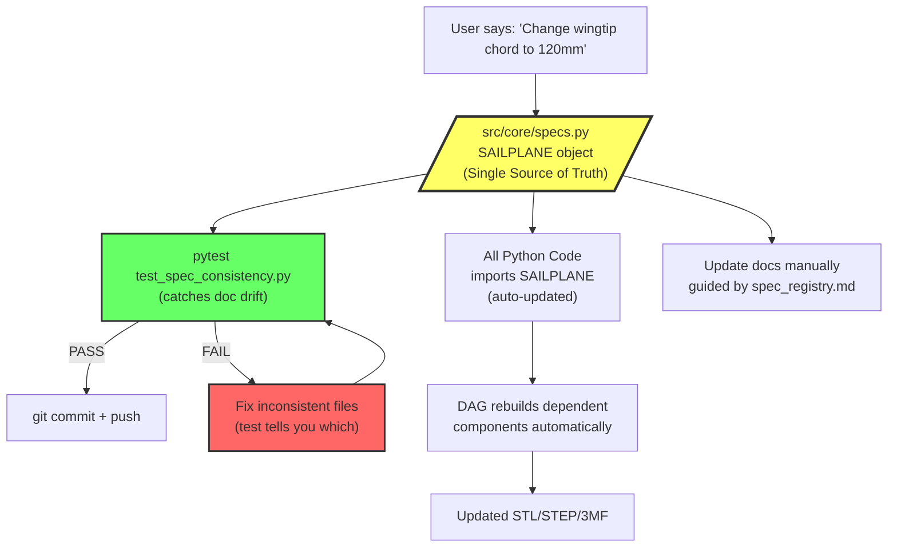
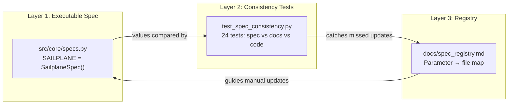
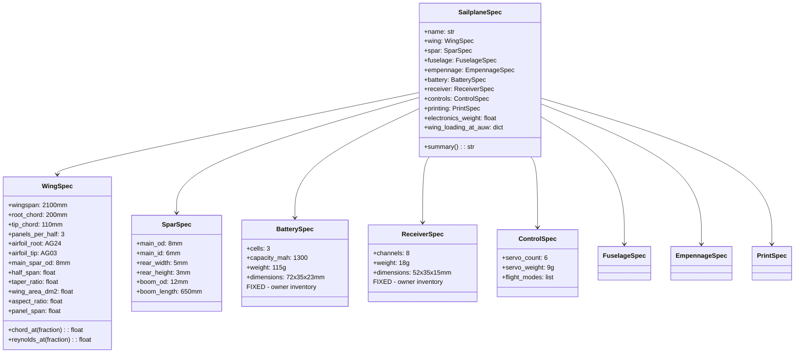
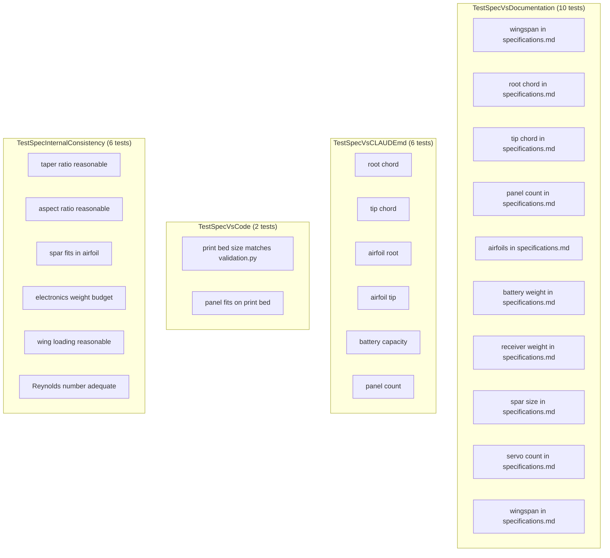
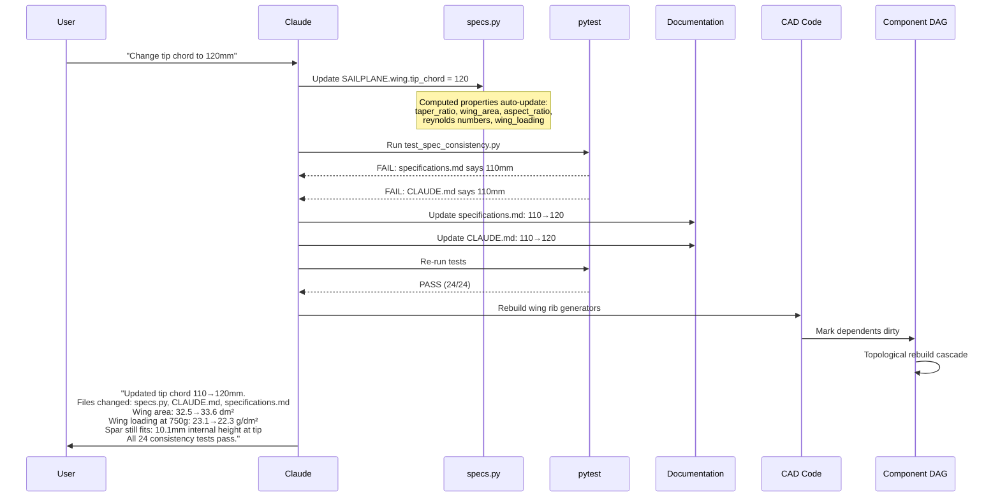
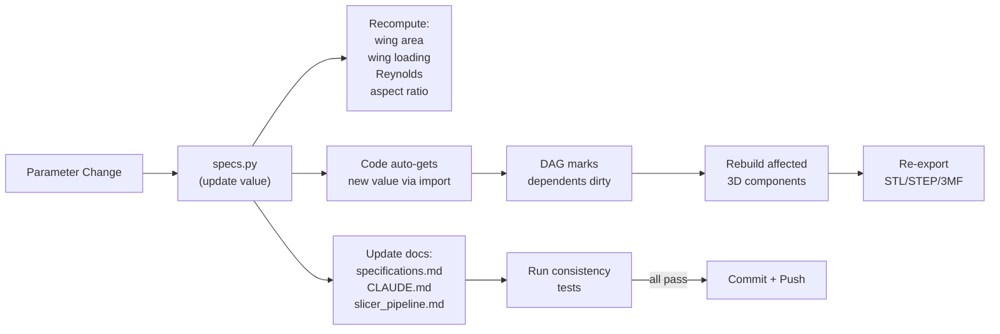

# Specification Consistency System

## How It Works

AeroForge uses a three-layer system to ensure design parameters never go out of sync
across documentation, code, and 3D models.

### Architecture Overview



### The Three Layers



## Layer 1: Executable Single Source of Truth

**File: `src/core/specs.py`**

All design parameters live in one Python object:

```python
from src.core.specs import SAILPLANE

# Access any parameter
wingspan = SAILPLANE.wing.wingspan           # 2100.0 mm
root_chord = SAILPLANE.wing.root_chord       # 200.0 mm
battery_weight = SAILPLANE.battery.weight    # 115.0 g

# Computed properties update automatically
wing_area = SAILPLANE.wing.wing_area_dm2     # computed from span + chord
wing_loading = SAILPLANE.wing_loading_at_auw # computed from area + weight
reynolds = SAILPLANE.wing.reynolds_at(0.5)   # computed from chord + velocity
```

### Spec Hierarchy



### Why Python, Not Markdown?

| Approach | Markdown spec file | Python spec object |
|----------|-------------------|-------------------|
| Can code import values from it? | No - must duplicate | **Yes - `from specs import SAILPLANE`** |
| Computed properties auto-update? | No - manual recalc | **Yes - `wing_area` recomputes** |
| Type-checked? | No | **Yes - Pydantic validates** |
| Testable? | Barely | **Yes - full pytest** |
| Human-readable? | Yes | **Yes - `SAILPLANE.summary()`** |

## Layer 2: Consistency Tests

**File: `tests/test_spec_consistency.py`**

24 automated tests in 4 categories:

### Test Categories



### What Happens When Tests Fail

Example: Someone changes `SAILPLANE.wing.wingspan = 2200` but forgets to update CLAUDE.md:

```
FAILED test_wingspan_in_claude_md
  AssertionError: CLAUDE.md doesn't contain wingspan 2200mm
```

The test tells you EXACTLY which file is wrong and what value is missing.

### Real Example: Spar Size Catch

When we first set the main spar to 10mm OD, this test caught it:

```
FAILED test_spar_fits_in_airfoil
  AssertionError: Spar 10.0mm doesn't fit in 9.2mm airfoil height at tip
```

The AG03 airfoil at 110mm tip chord is only 9.2mm thick. A 10mm tube physically
cannot fit inside it. The test caught this BEFORE any 3D model was generated.
We corrected to 8mm.

## Layer 3: Spec Registry

**File: `docs/spec_registry.md`**

A human-readable map of where each parameter appears. Used as a checklist
when updating, but NOT the primary guardrail (tests are).

```
Wingspan → specs.py, CLAUDE.md, specifications.md, slicer_pipeline.md, wing code, tests
Chord → specs.py, CLAUDE.md, specifications.md, wing code, tests
Airfoil → specs.py, CLAUDE.md, specifications.md, airfoil code, tests
...
```

## Change Workflow

### When User Changes a Parameter



### Full Update Cascade



## Running the Tests

```bash
# Run only consistency tests (fast, < 1 second)
pytest tests/test_spec_consistency.py -v

# Run all tests including core framework
pytest tests/ -v

# Print current spec summary
python -c "from src.core.specs import SAILPLANE; print(SAILPLANE.summary())"
```

## Adding New Parameters

When adding a new design parameter:

1. Add the field to the appropriate spec class in `specs.py`
2. Add a consistency test in `test_spec_consistency.py`
3. Add the parameter to the docs where relevant
4. Add an entry to `spec_registry.md`
5. Run all tests to confirm

## Adding New Files That Reference Parameters

When creating a new file that uses any design parameter:

1. Import from `specs.py`: `from src.core.specs import SAILPLANE`
2. Use `SAILPLANE.wing.wingspan` (not hardcoded `2100`)
3. Add the file to `spec_registry.md` under each parameter it uses
4. Add a consistency test if the file contains hardcoded reference values
