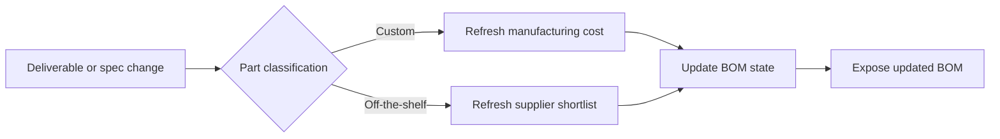

# Living BOM and Procurement

The bill of materials is a **living project artifact**, not a static report.

It must stay synchronized with:

- deliverable regeneration
- material changes
- manufacturing changes
- geometry changes for custom parts
- specification changes for off-the-shelf parts
- procurement shortlist or quote updates

## BOM Flow

## Responsibilities

For custom parts:

- estimate production cost from geometry, material, and process data
- refresh manufacturing assumptions when deliverables change

For off-the-shelf parts:

- maintain supplier/provider candidates
- update price, lead time, and source metadata when the selected specification changes

## Procurement Rule

Procurement should remain simple and transparent in the framework layer:

- record provider assumptions
- record location context
- keep shortlists and quotes attached to the current specification
- let BOM updates reflect the latest accepted state of the project
