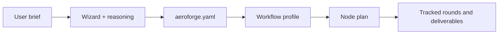

# Initialization and Project Profile

Initialization is the boundary between ambiguous project reasoning and
deterministic execution.

## What the Wizard Captures

The wizard and upstream reasoning step capture:

- the requested aircraft or body class
- project scope
- top object
- location context for procurement and quoting
- tooling availability
- manufacturing technique
- material strategy
- production strategy
- deliverable strategy

These values are persisted in `aeroforge.yaml`.

## Why the Profile Matters

The project profile is the deterministic contract used by the workflow engine.
It keeps the engine generic while allowing the project to be:

- a paper airplane
- a paraglider wing
- an RC sailplane
- a drone interceptor
- a full-size wing or other partial assembly

## Profile Lifecycle

## Rule

Do not hard-code aircraft type, tooling, manufacturing technique, material
strategy, or deliverable strategy into deterministic logic. Persist them as
project decisions, then let code enforce sequencing and state.
