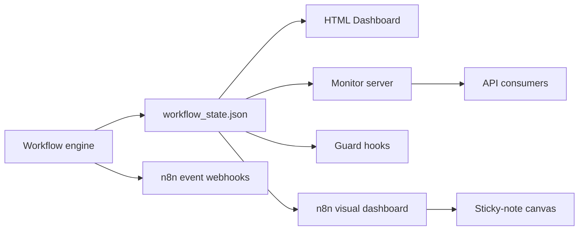

# Monitoring, Hooks, and n8n

The workflow must remain visible and accountable while it runs.

## Monitoring Stack

- `.claude/workflow_state.json` as the state source of truth
- `exports/workflow_dashboard.html` as the visual dashboard
- the local monitor server for status APIs and HTML serving
- workflow guard hooks for stage enforcement
- `n8n` visibility layer for event handling and runtime chart (always started)

## Live Monitoring Story

## Guardrail Rule

The visible chart is not enough on its own. The system also needs:

- step guards that block the wrong type of work at the wrong stage
- recorded deliverables for each node/stage
- consistent round labels
- deterministic sequencing after upstream decisions are captured

## n8n Position

`n8n` is a **mandatory** component. The engine auto-launches it if not running
and hard-stops if it remains unreachable after 30 seconds.

n8n hosts two workflows:

1. **AeroForge Dashboard** — Visual sticky-note canvas on the n8n editor,
   rebuilt on every state change. Shows project phases (color-coded),
   component hierarchy grid with per-step status, active work banner,
   validation section, and convergence criteria. Generated by
   `src/orchestrator/n8n_workflow_builder.py`.

2. **AeroForge Events** — Webhook receivers for telemetry events
   (project sync, step events, deliverables, validation).

The persisted `workflow_state.json` remains the authoritative source of truth.
n8n is the visibility layer — it reads state, it does not own it.
