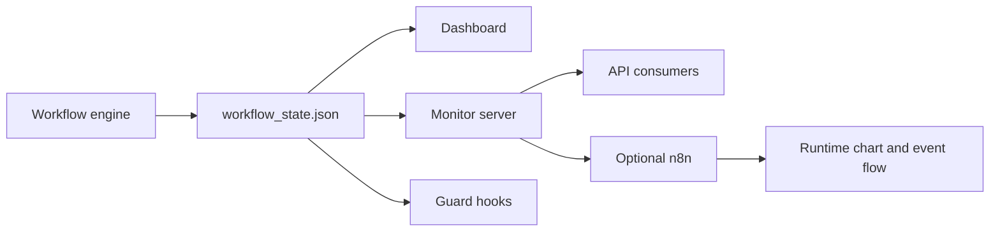

# Monitoring, Hooks, and n8n

The workflow must remain visible and accountable while it runs.

## Monitoring Stack

- `.claude/workflow_state.json` as the state source of truth
- `exports/workflow_dashboard.html` as the visual dashboard
- the local monitor server for status APIs and HTML serving
- workflow guard hooks for stage enforcement
- optional `n8n` integration for event handling and runtime visibility

## Live Monitoring Story

## Guardrail Rule

The visible chart is not enough on its own. The system also needs:

- step guards that block the wrong type of work at the wrong stage
- recorded deliverables for each node/stage
- consistent round labels
- deterministic sequencing after upstream decisions are captured

## n8n Position

`n8n` is an optional workflow runtime and visibility layer. It is not the only
source of truth. The deterministic engine and persisted workflow state remain
authoritative.
