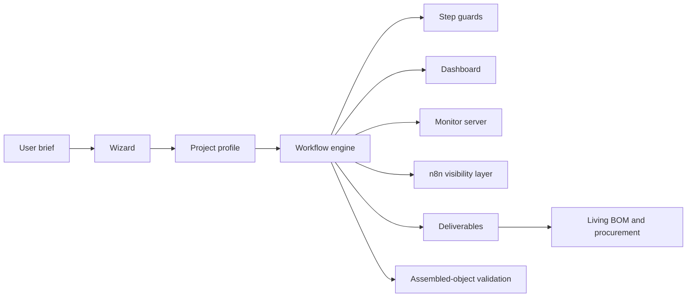

# AeroForge Overview

AeroForge is a generic design framework for heavier-than-air flying objects.
It combines:

- upstream reasoning for ambiguous project decisions
- deterministic workflow enforcement once those decisions are captured
- visible status tracking across rounds, nodes, and deliverables
- living BOM and procurement synchronization as the design evolves

## Boundary Rule

Upstream reasoning decides project-specific facts such as:

- aircraft or body class
- project scope
- tooling
- manufacturing technique
- material strategy
- production strategy
- output artifacts

Deterministic code is responsible for:

- persisting the profile
- enforcing step order
- enforcing dependencies
- tracking the active step
- surfacing workflow state through the monitor stack
- synchronizing deliverables, BOM state, and procurement state
- running final assembled-object validation

## System View

## Design Intent

The framework is meant to cover a range of outcomes, including:

- paper aircraft and fold-based outputs
- RC aircraft with mixed custom and off-the-shelf parts
- outsourced or factory-produced subassemblies
- component-only or assembly-only design requests

The current AIR4 sailplane remains a useful example, but it is not the
framework itself.
