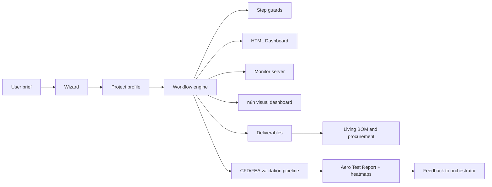
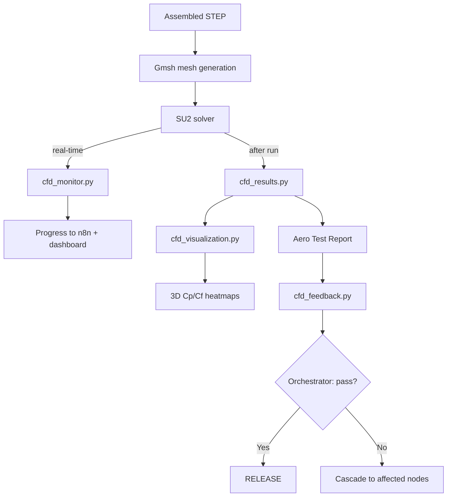

# AeroForge Overview

AeroForge is a generic design framework for heavier-than-air flying objects.
It combines:

- upstream reasoning for ambiguous project decisions
- deterministic workflow enforcement once those decisions are captured
- visible status tracking across rounds, nodes, and deliverables
- living BOM and procurement synchronization as the design evolves

## Boundary Rule

Upstream reasoning decides project-specific facts such as:

- aircraft or body class
- project scope
- tooling
- manufacturing technique
- material strategy
- production strategy
- output artifacts

Deterministic code is responsible for:

- persisting the profile
- enforcing step order
- enforcing dependencies
- tracking the active step
- surfacing workflow state through the monitor stack
- synchronizing deliverables, BOM state, and procurement state
- running final assembled-object validation

## System View

## Design Intent

The framework is meant to cover a range of outcomes, including:

- paper aircraft and fold-based outputs
- RC aircraft with mixed custom and off-the-shelf parts
- outsourced or factory-produced subassemblies
- component-only or assembly-only design requests

The current AIR4 sailplane remains a useful example, but it is not the
framework itself.

## CFD/FEA Validation Pipeline

The VALIDATION phase uses a dedicated analysis pipeline:

Key separation of concerns:

- **cfd_results.py**: Parses SU2 output, extracts Cp/Cf, computes stability
  derivatives (CL_alpha, CM_alpha, neutral point), drag breakdown
  (pressure/friction/induced), generates industry-standard Aero Test Report
- **cfd_monitor.py**: Polls SU2 residuals during execution, reports progress
  and ETA, detects divergence early
- **cfd_visualization.py**: ParaView 3D heatmaps for Cp and Cf (4 views each),
  matplotlib fallback when ParaView unavailable
- **cfd_feedback.py**: Structured output the orchestrator consumes to decide
  cascade targets — contains only aerodynamic data, no hierarchy knowledge

## n8n Visual Dashboard

n8n provides two workflows:

1. **AeroForge Dashboard**: Visual sticky-note canvas rebuilt on every state
   change — shows project phases, component hierarchy, active step, validation
2. **AeroForge Events**: Webhook receivers for telemetry events

n8n is mandatory. The engine hard-stops if n8n is unreachable.

## BOM and Procurement

The Bill of Materials and procurement data are per-project:

- `projects/{slug}/aeroforge.bom.yaml` — machine-readable BOM
- `projects/{slug}/docs/BOM.md` — human-readable markdown view

Framework code in `src/core/bom.py`, `bom_sync.py`, `procurement.py` is
generic and shared. Project-specific data (suppliers, costs, quantities)
lives in the project directory.
