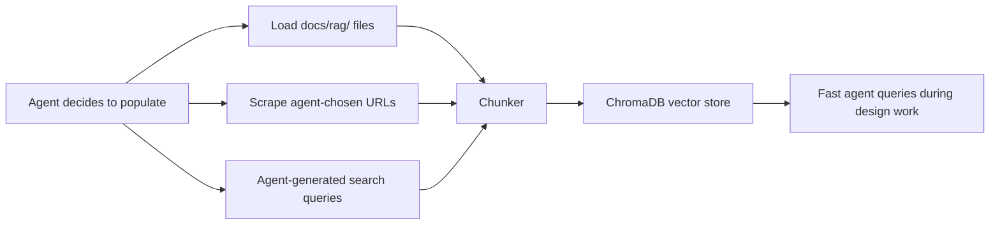

# RAG Knowledge Base

The RAG vector database is an **optional** project-local intelligence cache.
Agents decide whether and when to populate and query it. It is not a mandatory
workflow step.

## When RAG Adds Value

The RAG has exactly one advantage over web search: **speed during iterative
design decisions.** When an aerodynamicist agent makes 50 micro-decisions in
one round (chord ratio, taper, sweep, tip shape...), each should be
sanity-checked against real-world competition data. 50 web searches are slow.
A pre-loaded reference set queried in ~10ms is not.

## Intelligence Hierarchy

Agents should prefer tools in this order:

| Priority | Tool | Speed | When |
|----------|------|-------|------|
| 1 | LLM built-in knowledge | Instant | Always, first |
| 2 | RAG database | ~10ms | When populated, for fast benchmark lookups |
| 3 | `docs/rag/` curated files | ~100ms | Direct Read for project-specific refs |
| 4 | WebSearch | 2-5s | When current or specific data is needed |
| 5 | WebFetch | 2-5s | When a specific URL is known |

## Architecture



**No hardcoded aircraft types.** The agent generates search queries from the
user's mission prompt. The vehicle type is fully LLM-determined — it can be
a paper airplane, a racing drone, an F5J sailplane, or a full-size ultralight.

## API

```python
from src.rag import populate_rag, query_rag, add_to_rag

# Agent populates during RESEARCH step
db = populate_rag(
    project_code="AIR4",
    mission_prompt="F5J thermal sailplane",
    web_queries=["F5J competition rules FAI", "3D printed glider construction"],
)

# Agent queries during design decisions
results = query_rag("planform taper ratio F5J", project_code="AIR4")

# Agent adds a specific useful URL it found
add_to_rag("https://example.com/f5j-design-guide", project_code="AIR4")
```

## Storage

- **Location:** `.aeroforge/rag_db/` (project-local, gitignored)
- **Backend:** ChromaDB PersistentClient
- **Embeddings:** sentence-transformers (all-MiniLM-L6-v2), local, no API key

## Components

| Module | Purpose |
|--------|---------|
| `src/rag/config.py` | Configuration: paths, model, chunk sizes |
| `src/rag/chunker.py` | Heading-aware markdown/HTML/plain text splitting |
| `src/rag/database.py` | ChromaDB wrapper: create, add, query, stats |
| `src/rag/loader.py` | Load existing `docs/rag/` files into the DB |
| `src/rag/scraper.py` | Web scraping (agent provides the queries) |
