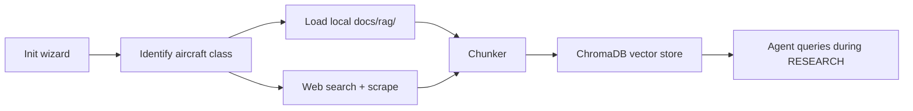

# RAG Knowledge Base

The RAG (Retrieval-Augmented Generation) vector database is a project-local
knowledge base that is populated after the initialization wizard completes.
It provides semantic search over domain-specific research data so that agents
can find relevant context during the RESEARCH workflow step.

## Architecture



## Components

| Module | Purpose |
|--------|---------|
| `src/rag/config.py` | Configuration: paths, model, chunk sizes |
| `src/rag/chunker.py` | Heading-aware markdown/HTML/plain text splitting |
| `src/rag/database.py` | ChromaDB wrapper: create, add, query, stats |
| `src/rag/loader.py` | Load existing `docs/rag/` files into the DB |
| `src/rag/scraper.py` | Web search query generation and content scraping |
| `src/rag/__init__.py` | Public API: `init_rag_database()`, `query_rag()` |

## Storage

- **Location:** `.aeroforge/rag_db/` (project-local, gitignored)
- **Backend:** ChromaDB with PersistentClient
- **Embeddings:** sentence-transformers (all-MiniLM-L6-v2), runs locally
- **Collections:** one per project, named `{project_code}_{aircraft_type}`

## Population Pipeline

Runs automatically after the init wizard:

1. **Load local docs:** walks `docs/rag/` recursively, chunks all `.md` files
2. **Generate search queries:** based on aircraft class keywords (sailplane, drone, paper airplane, etc.)
3. **Web search and scrape:** fetches top results per query, chunks content
4. **Embed and store:** all chunks go into a single ChromaDB collection

The pipeline is idempotent — re-running clears and repopulates.

## Querying

Agents query the RAG during the RESEARCH step:

```python
from src.rag import query_rag

results = query_rag("F5J competition rules wingspan limits", n_results=5)
for r in results:
    print(r["text"], r["metadata"]["source_type"])
```

Results include `text`, `metadata` (source_file, source_url, section), and
`distance` (cosine similarity).

## Domain Templates

The scraper has built-in search query templates for common aircraft classes:
sailplane, glider, drone, interceptor, paper airplane, paraglider. Unknown
types fall back to generic aerodynamic design queries.

## Adding Sources

To add local reference documents:
1. Place `.md` files under `docs/rag/`
2. Re-run the init wizard or call `init_rag_database()` directly

To add web sources:
- The scraper generates queries automatically from the aircraft type
- Custom URLs can be scraped directly via `DomainScraper.scrape_url()`
