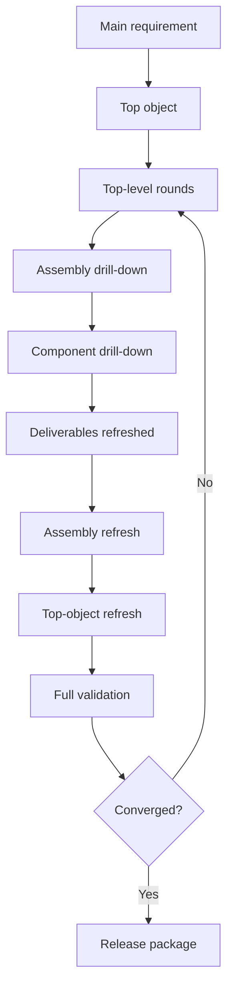

# Workflow and Iteration Model

The standing AeroForge method is:

1. capture the main requirement
2. initialize the project profile
3. define the top object and parent geometry
4. iterate top-down before drilling into child nodes
5. refresh bottom-up after local changes
6. validate the assembled top object
7. open another round if convergence fails

## Stage Sequence

Every tracked node follows this deterministic stage order. The active stage is
surfaced through the monitor stack and enforced through hooks.

## Top-Down, Drill-Down, Bottom-Up

## Validation Rule

Final aerodynamic and structural convergence is a **full-object activity**.

Local component checks still matter for:

- fit
- manufacturability
- packaging
- mass contribution
- interface integrity

But synthetic wind-tunnel and structural convergence belong to the assembled
top object, not isolated parts.

## Internal Non-Aerodynamic Components

Some components affect:

- mass
- inertia
- center of gravity
- packaging
- stiffness
- routing

without materially affecting the external aerodynamic shape. Those components
can skip aerodynamic treatment while still participating in structural,
packaging, and BOM/procurement flows.
