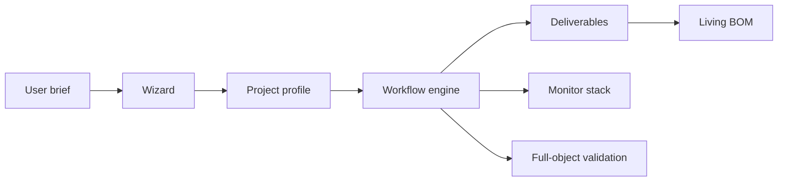

# AeroForge Overview

Canonical source:
[docs/framework/overview.md](https://github.com/ipanov/aeroforge/blob/master/docs/framework/overview.md)

AeroForge is a generic design framework for heavier-than-air flying objects. It
separates upstream project reasoning from deterministic execution, then enforces
workflow state, deliverables, visibility, and living BOM/procurement behavior.

## System View

