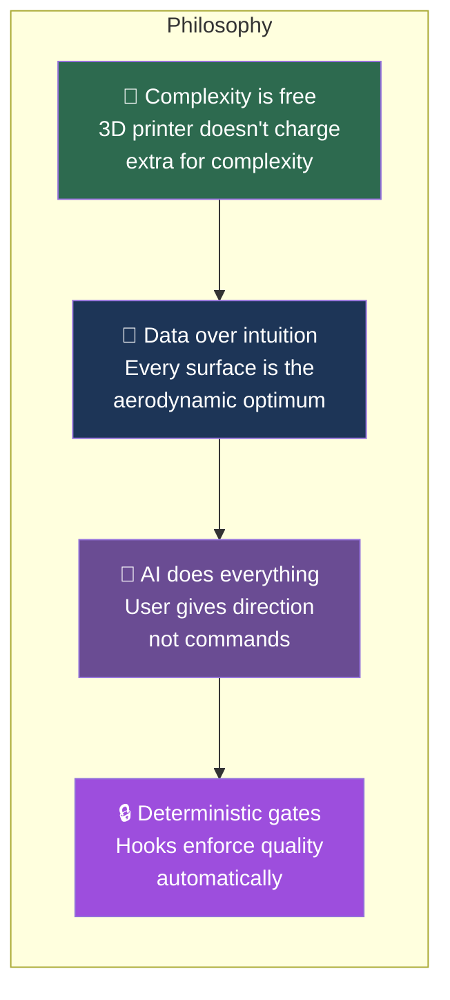
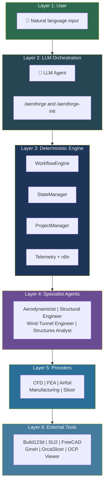

# AeroForge Overview

## What AeroForge Is

AeroForge is an **AI-autonomous aircraft design framework**. It provides:

- A **deterministic workflow engine** that sequences design steps, enforces quality gates, and tracks state across a hierarchical tree of components and assemblies.
- A **provider system** that abstracts CFD, FEA, airfoil analysis, manufacturing, and slicing behind swappable backends.
- **Four specialist agents** (Aerodynamicist, Structural Engineer, Wind-Tunnel Engineer, Structures Analyst) that the LLM spawns at the right moments.
- **13 deterministic hooks** that block bad work product before it reaches production paths.
- A **multi-project structure** where the framework is shared and each aircraft gets its own project directory.

The LLM (Claude Code, Codex, or any capable agent) is the orchestrator. It reads workflow state, decides what to do next, spawns agents, and presents deliverables for user approval. The deterministic engine ensures nothing is skipped.

## What AeroForge Is Not

| Not this | Why |
|----------|-----|
| A CLI tool | There are no user-facing commands. The LLM runs everything. |
| A single-aircraft system | The framework is aircraft-type agnostic. Sailplane, drone, interceptor -- same engine. |
| A CAD program | It orchestrates Build123d (headless Python CAD), OCP Viewer, and FreeCAD FEM. |
| A simulation suite | It orchestrates SU2 (CFD) and CalculiX (FEA) through providers. |
| An opinionated geometry library | Agents decide shapes. The engine enforces process, not design. |

---

## Design Philosophy



### Core Principles

1. **Maximize printed complexity.** Blended airfoils at every rib, geodetic lattice, topology-optimized mounts. The printer does not care about geometric complexity -- exploit this.

2. **Never simplify without data.** The phrase "for simplicity" is blocked unless accompanied by a quantified mass/strength tradeoff. Every junction, fillet, blend, and transition is optimized.

3. **Agents decide shapes.** The aerodynamicist compares at least 3 options with quantified performance before selecting. The main thread never overrides an agent's shape selection with a hardcoded alternative.

4. **Drawing-first workflow.** A 2D technical drawing must be created and approved before any 3D modeling begins. This forces design consensus before expensive geometry work.

5. **Dual quality gates.** Every component passes both a testing gate (dimensional assertions via pytest) and a validation gate (visual comparison of renders).

6. **Specification consistency.** When any design parameter changes, all references update immediately. `docs/specifications.md` is the single source of truth; `docs/spec_registry.md` tracks every file that references a parameter.

---

## Architecture Layers



---

## The LLM / Deterministic Boundary

The system draws a clear line between what the LLM decides and what the deterministic engine enforces:

| LLM decides | Engine enforces |
|-------------|-----------------|
| Aircraft type, mission, scope | Step ordering (cannot skip steps) |
| Airfoil selection, planform, dimensions | Drawing-first gate (no 3D without approved 2D) |
| Which nodes to redesign after validation | Folder structure and naming conventions |
| Agent spawning and interpretation | Collision / containment checks |
| Natural language interaction with user | BOM sync on every deliverable change |
| Manufacturing strategy and materials | Anti-simplification language blocking |

The LLM is free to make creative decisions. The engine ensures those decisions follow the process.

---

## Repository Structure

```
aeroforge/
├── src/                          # Framework (shared across projects)
│   ├── core/                     # Component model, DAG, BOM
│   ├── orchestrator/             # Workflow engine, state, project manager
│   ├── providers/                # Swappable analysis/manufacturing backends
│   ├── cad/                      # Build123d parametric models
│   ├── analysis/                 # FreeCAD headless wrappers
│   └── rag/                      # ChromaDB knowledge base
├── config/                       # System-level provider config
├── hooks/                        # 13 deterministic enforcement hooks
├── .claude/
│   ├── agents/                   # 4 specialist agent definitions
│   └── commands/                 # /aeroforge and /aeroforge-init skills
├── projects/
│   ├── air4-f5j/                 # Example: F5J thermal sailplane
│   │   ├── aeroforge.yaml        # Project config + providers
│   │   ├── cad/                  # Components + assemblies
│   │   └── docs/                 # Project-specific documentation
│   └── (your-project)/           # Created via /aeroforge-init
├── docs/                         # Framework documentation
└── tests/                        # 119+ tests
```
