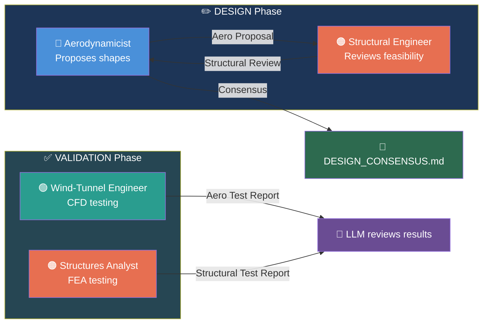
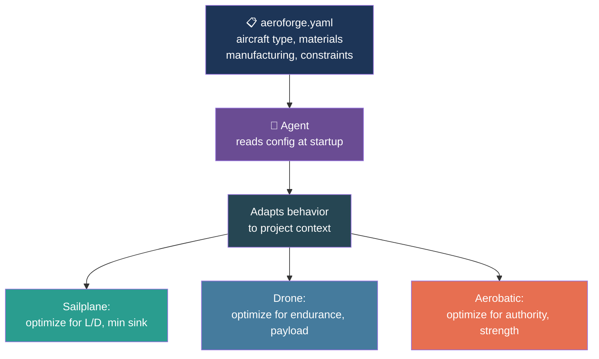
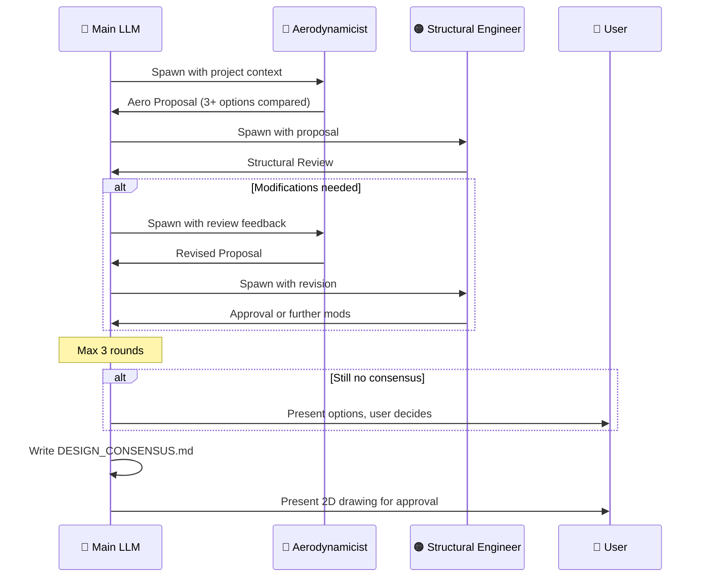

# Agents

AeroForge uses four specialist agents, each spawned by the LLM at specific points in the workflow. Agents are defined in `.claude/agents/` and are parameterized at runtime from the active project's configuration.

---

## Agent Overview

---

## The Four Agents

### 1. Aerodynamicist

| Property | Value |
|----------|-------|
| **File** | `.claude/agents/aerodynamicist.md` |
| **Color** | Blue |
| **Model** | Opus |
| **Phase** | DESIGN (per-node AERO_PROPOSAL and AERO_RESPONSE steps) |
| **Tools** | Bash, Read, Grep, Glob, WebSearch, WebFetch |

**Role:** Expert aerospace engineer (MSc level) specializing in aerodynamic design. Every decision backed by numbers, every airfoil choice justified by polar analysis at the actual operating Reynolds number.

**When spawned:**
- AERO_PROPOSAL step -- produces the initial aerodynamic proposal
- AERO_RESPONSE step -- revises proposal after structural review

**Output:** Aero Proposal document with:
- At least 3 design options compared with quantified performance
- Airfoil selection with polar data at operating Reynolds numbers
- Planform dimensions, taper, twist, control surface sizing
- Performance predictions (L/D, stall speed, control authority)

**Rules:**
- Must compare at least 3 options -- never presents a single choice
- Reads project config (`aeroforge.yaml`) first to understand aircraft type, materials, and constraints
- Queries RAG database for competitive intelligence before designing
- Never prescribes -- the agent decides the optimal shapes based on data

---

### 2. Structural Engineer

| Property | Value |
|----------|-------|
| **File** | `.claude/agents/structural-engineer.md` |
| **Color** | Orange |
| **Model** | Opus |
| **Phase** | DESIGN (per-node STRUCTURAL_REVIEW step) |
| **Tools** | Bash, Read, Grep, Glob, WebSearch, WebFetch |

**Role:** Expert mechanical engineer (MSc level) specializing in lightweight structures and manufacturing techniques. Reviews aerodynamic proposals for feasibility, mass, strength, and manufacturability.

**When spawned:**
- STRUCTURAL_REVIEW step -- reviews the aerodynamicist's proposal

**Output:** Structural Review document with:
- Mass budget assessment
- Spar sizing and placement recommendations
- Printability analysis (wall thickness, overhangs, support needs)
- Material selection and attachment design
- Specific modification requests with numbers

**Rules:**
- Always runs AFTER the aerodynamicist
- If modifications are needed, the aerodynamicist gets another pass
- Max 3 rounds before the user decides
- Reads project manufacturing strategy to understand constraints

---

### 3. Wind-Tunnel Engineer

| Property | Value |
|----------|-------|
| **File** | `.claude/agents/wind-tunnel-engineer.md` |
| **Color** | Cyan |
| **Model** | Opus |
| **Phase** | VALIDATION |
| **Tools** | Bash, Read, Write, Edit, Grep, Glob, WebSearch, WebFetch |

**Role:** Virtual wind tunnel operator. Takes geometry, meshes it (Gmsh), runs SU2 CFD, and produces quantified Aero Test Reports.

**When spawned:**
- VALIDATION phase -- after all 3D models and assemblies exist

**Output:** Aero Test Report with:
- CL, CD, CM vs alpha polars
- Pressure distributions and surface contours
- Interference drag identification at junctions
- Stability derivatives
- Specific improvement recommendations with quantified impact

**Difference from Aerodynamicist:** The aerodynamicist PROPOSES shapes. The wind-tunnel engineer TESTS what has been designed.

---

### 4. Structures Analyst

| Property | Value |
|----------|-------|
| **File** | `.claude/agents/structures-analyst.md` |
| **Color** | Orange |
| **Model** | Opus |
| **Phase** | VALIDATION |
| **Tools** | Bash, Read, Write, Edit, Grep, Glob, WebSearch, WebFetch |

**Role:** Master-level structural analyst performing FEA on aircraft components and assemblies using FreeCAD headless FEM (CalculiX solver).

**When spawned:**
- VALIDATION phase -- after all 3D models and assemblies exist

**Output:** Structural Test Report with:
- Bending, torsion, and buckling analysis
- Safety factors at every load case
- Flutter margin assessment
- Specific reinforcement recommendations

**Difference from Structural Engineer:** The structural engineer REVIEWS proposals for mass/printability during design. The structures analyst TESTS the finished geometry under flight loads.

---

## Agent Parameterization

Agents are **generic** -- they read project configuration at runtime:

The agent prompt files (`.claude/agents/*.md`) define the base role and expertise. The project's `aeroforge.yaml` provides:
- Aircraft type and mission prompt
- Manufacturing technique and tooling constraints
- Materials and their properties
- Provider selections (which CFD/FEA tools are available)

This means the same aerodynamicist agent designs a sailplane wing, a drone prop guard, or an interceptor canard -- adapting its optimization targets based on the project.

---

## Agent Interaction Protocol

---

## Assembly-Level Agent Review

When assembling multiple aerodynamic components, the agent team reviews the assembly integration (not just individual components):

- **Aerodynamicist** reviews interference drag at junctions, gap effects, overall aerodynamic interaction
- **Structural Engineer** reviews fit, clearance, collision, and load paths through the assembly
- This is separate from the per-component design cycle
