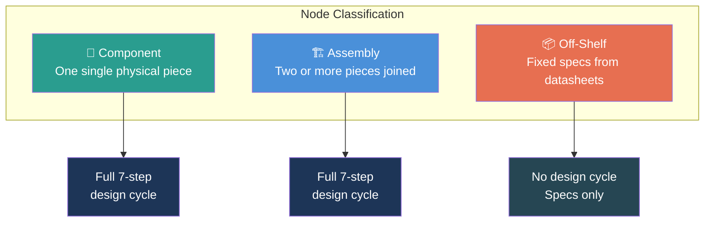
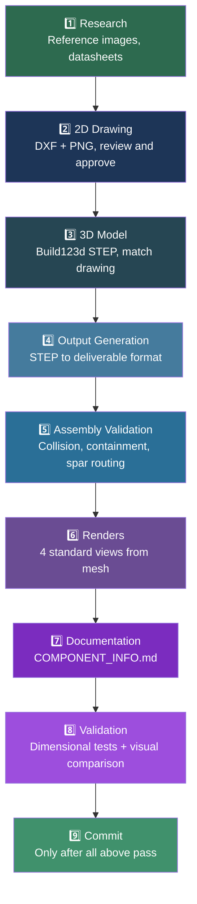
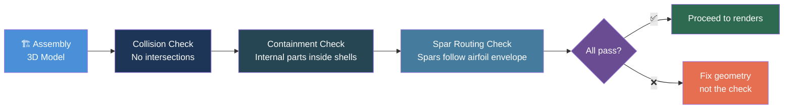

# Components and Assemblies

AeroForge models every aircraft as a hierarchical tree of **nodes**. Each node is classified as a component, assembly, or off-shelf item.

---

## Node Types



| Type | Design Cycle | Examples |
|------|-------------|----------|
| **component** | Full 7-step cycle | Wing panel, elevator, fuselage nose section |
| **assembly** | Full 7-step cycle | Wing assembly, H-stab assembly, the whole aircraft |
| **off_shelf** | None | Servo, battery, carbon rod, screw |

### Key Rules

- **Component** = ONE single physical piece. Never contains other pieces. A TPU strip, a carbon rod, a single screw -- each is its own component.
- **Assembly** = TWO or more components (or sub-assemblies) joined together with constraints.
- **Off-shelf** = Purchased items with fixed dimensions from datasheets. No design cycle, just captured specs.
- The top-level aircraft is just another assembly -- there is no special "master" level.

---

## Component Model

Every node carries these properties:

| Property | Type | Description |
|----------|------|-------------|
| `mass` | grams | Physical mass |
| `cg` | (x, y, z) mm | Center of gravity in local coordinates |
| `inertia_tensor` | 3x3 matrix | Rotational inertia |
| `bounding_box` | (min, max) | Axis-aligned bounding box |
| `coordinate_system` | origin + axes | Local reference frame |

```python
# Class hierarchy
Component
├── OffShelfComponent   # servos, motors, screws -- fixed dims from datasheets
└── CustomComponent     # designed parts -- parametric, from design cycle

Assembly = Component + Component [+ Component...] + constraints
```

---

## CAD Folder Structure

The CAD tree follows the "Clear Skies" organization. Every component and assembly gets its own folder with a strict set of artifacts.

```
cad/
├── components/{category}/{ComponentName}/
│   ├── DESIGN_CONSENSUS.md           # Agent consensus (before drawing)
│   ├── ComponentName_drawing.dxf     # 2D technical drawing (FIRST)
│   ├── ComponentName_drawing.png     # PNG render of drawing
│   ├── ComponentName.step            # 3D model (AFTER drawing approval)
│   ├── ComponentName.3mf             # Print-ready file (for printed parts)
│   ├── renders/                      # 4 standard views
│   │   ├── isometric.png
│   │   ├── front.png
│   │   ├── top.png
│   │   └── right.png
│   └── COMPONENT_INFO.md            # Documentation
│
└── assemblies/{category}/{AssemblyName}/
    ├── DESIGN_CONSENSUS.md
    ├── AssemblyName_drawing.dxf
    ├── AssemblyName_drawing.png
    ├── AssemblyName.step
    ├── renders/
    └── ASSEMBLY_INFO.md
```

### Categories

Components and assemblies are organized by category:

| Category | Description | Examples |
|----------|-------------|---------|
| `empennage/` | Tail surfaces | H-stab, V-stab, elevator, rudder |
| `wing/` | Wing parts | Wing panels, ailerons, flaps |
| `fuselage/` | Body parts | Nose, pod, boom, tail cone |
| `hardware/` | Off-shelf items | Servos, batteries, rods, screws |
| `propulsion/` | Motor/prop/ESC | Motor mount, spinner, propeller |

---

## Mandatory Workflow Order



**The 2D drawing is always created and approved BEFORE any 3D modeling.** This is enforced by hooks.

---

## Off-Shelf Components

Off-shelf items have no design cycle. Their handling:

1. **Datasheet capture** -- dimensions, mass, connection type from manufacturer specs
2. **YAML specification** -- stored in `components/` at the repo root (YAML format)
3. **CAD representation** -- simplified STEP geometry for assembly collision checks
4. **BOM entry** -- supplier, cost, link, lead time

Off-shelf components participate in assemblies as fixed-dimension items. They constrain the design (e.g., servo horn throw determines control surface deflection range).

---

## Symmetric Components

For symmetric assemblies (e.g., left/right wing halves or stabilizer halves):

- **Only ONE component definition exists** for geometrically identical mirrored parts
- The mirror is generated at assembly time in the mesh pipeline
- Do NOT create separate Left/Right component folders for the same shape

---

## Assembly Validation

Every assembly must pass three checks before renders or commit:

| Check | Rule | Script |
|-------|------|--------|
| **Collision** | No two components may intersect (boolean AND volume = 0) | `src/cad/validation/assembly_check.py` |
| **Containment** | Internal components (spars, rods) fully inside their shells | `src/cad/validation/assembly_check.py` |
| **Spar routing** | Every spar/rod stays inside the airfoil envelope at every span station | `src/cad/validation/assembly_check.py` |



---

## Naming Conventions

| Artifact | Pattern | Example |
|----------|---------|---------|
| Component folder | `PascalCase` | `WingPanel_P1/` |
| Drawing DXF | `{Name}_drawing.dxf` | `WingPanel_P1_drawing.dxf` |
| Drawing PNG | `{Name}_drawing.png` | `WingPanel_P1_drawing.png` |
| 3D model | `{Name}.step` | `WingPanel_P1.step` |
| Print file | `{Name}.3mf` | `WingPanel_P1.3mf` |
| Info doc | `COMPONENT_INFO.md` or `ASSEMBLY_INFO.md` | Fixed name |
| Consensus | `DESIGN_CONSENSUS.md` | Fixed name |

All naming is enforced by the `cad_structure_validate` hook.
