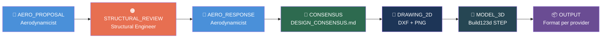
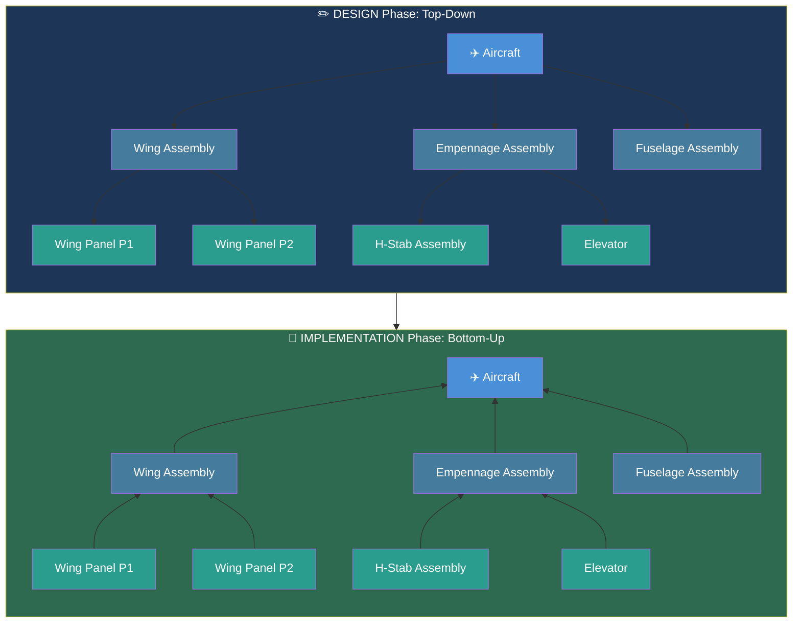
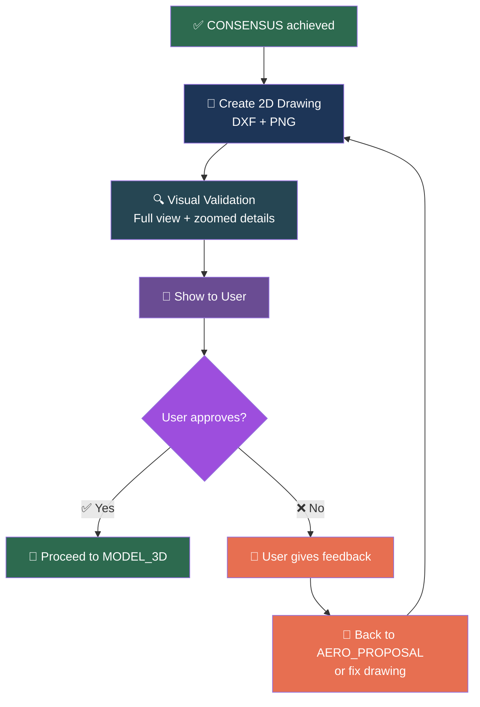
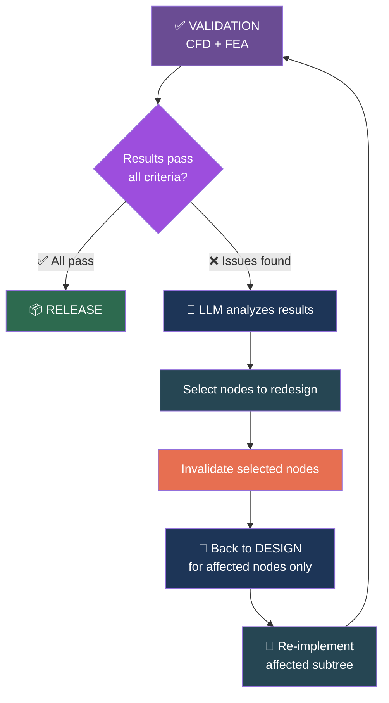

# Hierarchical Workflow

AeroForge uses a **hierarchical node tree** where each component and assembly has its own design cycle. The workflow operates at two levels: top-level project phases and per-node design steps.

---

## Project Phases

Six sequential phases govern the overall project lifecycle:

| Phase | What happens | Gate to next |
|-------|-------------|--------------|
| **REQUIREMENTS** | Capture mission brief, constraints, performance targets | User confirms brief |
| **RESEARCH** | RAG population, web search, competitive analysis, reference study | Sufficient domain knowledge gathered |
| **DESIGN** | Top-down drill: aero/structural agent cycles for every node | All nodes have approved 2D drawings |
| **IMPLEMENTATION** | Bottom-up build: 3D models from leaves to root | All nodes have OUTPUT deliverables |
| **VALIDATION** | CFD (SU2) + FEA (CalculiX) on assembled aircraft | All convergence criteria pass |
| **RELEASE** | Package deliverables, BOM, documentation | User signs off |

### Critical Gate: DESIGN to IMPLEMENTATION

**Every node in the tree must have an approved 2D drawing before IMPLEMENTATION begins.** This is the drawing-first gate. The engine checks this with `StateManager.check_design_phase_complete()`.

---

## Per-Node Design Cycle

Every component and assembly follows the same 7-step cycle:

| Step | Agent / Actor | Output | Notes |
|------|--------------|--------|-------|
| **AERO_PROPOSAL** | Aerodynamicist | Aero Proposal document | Must compare at least 3 design options |
| **STRUCTURAL_REVIEW** | Structural Engineer | Structural Review document | Mass, strength, manufacturability check |
| **AERO_RESPONSE** | Aerodynamicist | Revised proposal (if needed) | Addresses structural concerns |
| **CONSENSUS** | Both agents agree | `DESIGN_CONSENSUS.md` | Written to the node's folder |
| **DRAWING_2D** | LLM + ezdxf | DXF + PNG | User must approve before MODEL_3D |
| **MODEL_3D** | LLM + Build123d | STEP file | Dimensions must match drawing exactly |
| **OUTPUT** | Manufacturing provider | 3MF, STL, or other | Format determined by provider config |

### OUTPUT, Not MESH

The final step is called **OUTPUT** because the deliverable format depends on the manufacturing provider. For FDM 3D printing, OUTPUT is `STEP -> STL -> geodesic ribs -> 3MF`. For manual construction, OUTPUT might be laser-cut DXF templates. For CNC, it might be G-code. The provider decides.

---

## Top-Down Design, Bottom-Up Implementation

- **Design phase:** Start at the aircraft level, drill down through assemblies to leaf components. Each node runs its 7-step design cycle. The aerodynamicist and structural engineer work at the appropriate level of abstraction.
- **Implementation phase:** Build 3D models from leaves first (components), then assemble into parent assemblies, bottom-up. `StateManager.get_implementation_order()` returns the correct build sequence.

---

## Drawing Approval Gate

The DRAWING_2D step has a **mandatory user approval gate**:

No 3D modeling begins until the user approves the 2D drawing. This prevents expensive geometry rework.

---

## Validation Cascade

After IMPLEMENTATION, the VALIDATION phase runs CFD and FEA on the assembled aircraft. If issues are found, the LLM decides which nodes need redesign:

### Convergence Criteria

The iteration loop terminates when ALL criteria are satisfied:

| Criterion | Target | Verified by |
|-----------|--------|-------------|
| L/D at design CL | Type-specific (e.g., >= 15:1 for sailplane) | SU2 CFD |
| Interference drag | < 5% of total CD | SU2 CFD |
| Static margin | 5-15% MAC | SU2 CFD + calculations |
| Control authority | Surfaces achieve required moments | SU2 CFD |
| Structural safety factor | >= 1.5 all components | FreeCAD FEA |
| Flutter margin | >= 1.2 x VNE | FreeCAD modal + SU2 aero |
| All-up weight | Within target range | Mass tracking |
| Assembly collisions | Zero intersections | Collision check |

---

## Iteration Rules

1. **Max 3 agent rounds per node.** If the aerodynamicist and structural engineer cannot agree in 3 rounds, the user decides.
2. **User can reject any deliverable.** Rejection sends the node back with feedback. The LLM decides how far back to go (to AERO_PROPOSAL for fundamental changes, or just fix the drawing).
3. **Invalidation is surgical.** `StateManager.invalidate_node()` resets one node. `StateManager.invalidate_subtree()` resets a node and all descendants. The LLM chooses the minimal scope.
4. **Step status tracking.** Each step has a status: `pending`, `running`, `done`, `failed`, `skipped`. The engine prevents skipping steps or working out of order.

---

## Node Types and Design Cycle Applicability

| Node Type | Design Cycle | Description |
|-----------|-------------|-------------|
| **component** | Full 7-step cycle | A single physical piece (wing panel, elevator, fuselage section) |
| **assembly** | Full 7-step cycle | Two or more components joined (wing assembly, H-stab, the whole aircraft) |
| **off_shelf** | None (skipped) | Servo, battery, carbon rod, screw -- dimensions from datasheets |

Off-shelf nodes have no design cycle. Their specs are captured from datasheets and they participate in assemblies as fixed-dimension items.
