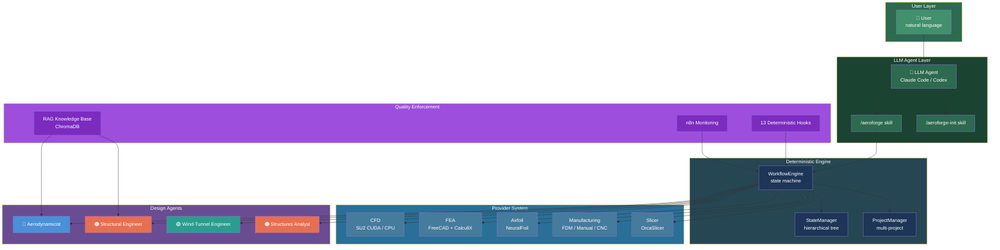

# AeroForge Wiki

**AI-autonomous design framework for heavier-than-air aircraft.**

AeroForge runs inside any LLM agent (Claude Code, Codex, etc.) as an autonomous design assistant. The LLM drives the workflow; a deterministic engine enforces quality gates, step sequencing, and validation. The user gives design direction in natural language -- the system handles everything else.

Not limited to one aircraft class, manufacturing method, or deliverable type. Paper airplane to interceptor drone -- same framework, different providers.

---

## Architecture



---

## Quick Start

```
/aeroforge-init    Initialize a new project (interactive conversation)
/aeroforge         Drive the active project's design workflow
```

The LLM reads project state, spawns design agents, updates workflow steps, and shows you deliverables for approval. You give design direction in natural language. You never type commands or run scripts.

---

## Pages

| Page | Description |
|------|-------------|
| [AeroForge Overview](AeroForge-Overview) | System philosophy, what AeroForge is and is not |
| [Hierarchical Workflow](Hierarchical-Workflow) | Project phases, per-node design cycle, iteration model |
| [Initialization and Project Profile](Initialization-and-Project-Profile) | How `/aeroforge-init` works, project structure |
| [Components and Assemblies](Components-and-Assemblies) | Node types, CAD folder structure, off-shelf rules |
| [Provider System](Provider-System) | System vs project providers, auto-detection, hardware profile |
| [Agents](Agents) | All 4 design agents, parameterization, when they run |
| [Hooks and Enforcement](Hooks-and-Enforcement) | 13 deterministic hooks, what they block, LLM boundary |
| [Living BOM and Procurement](Living-BOM-and-Procurement) | BOM sync, supplier strategy |
| [RAG Knowledge Base](RAG-Knowledge-Base) | ChromaDB vector store, population, querying |
| [Example Project: AIR4](Example-Project-AIR4) | The F5J thermal sailplane reference project |
| [Reference and Research Index](Reference-and-Research-Index) | Catalogs, benchmarks, research archive |
