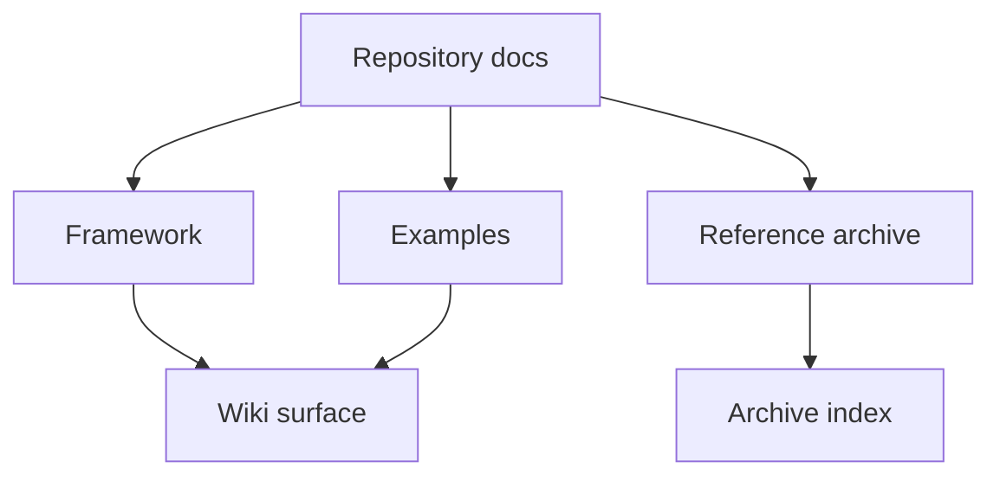

# AeroForge Wiki

Welcome to the published documentation surface for AeroForge.

The **canonical source of truth** remains the repository under `docs/`. The
wiki is a curated reading surface for the main framework and example-project
pages.

## What Lives Where

- Framework behavior: `docs/framework/`
- Example-project material: `docs/examples/`
- Reference and research archive: `docs/reference/`

## Recommended Start

- [AeroForge Overview](AeroForge-Overview)
- [Workflow and Iteration Model](Workflow-and-Iteration-Model)
- [Initialization and Project Profile](Initialization-and-Project-Profile)
- [Components, Assemblies, Tooling, and Deliverables](Components-Assemblies-Tooling-and-Deliverables)
- [Living BOM and Procurement](Living-BOM-and-Procurement)
- [Monitoring, Hooks, and n8n](Monitoring-Hooks-and-n8n)
- [Example Project: AIR4](Example-Project-AIR4)
- [Reference and Research Index](Reference-and-Research-Index)

## Documentation Map

Canonical repo docs:

- [Docs index](https://github.com/ipanov/aeroforge/blob/master/docs/README.md)
- [Framework docs](https://github.com/ipanov/aeroforge/blob/master/docs/framework/README.md)
- [AIR4 example](https://github.com/ipanov/aeroforge/blob/master/docs/examples/AIR4.md)
