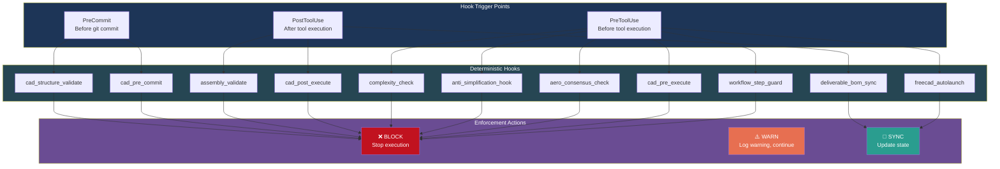

# Hooks and Enforcement

AeroForge uses **13 deterministic hooks** that run automatically on every tool call, file write, or git commit. They enforce quality gates that the LLM cannot bypass. If a hook blocks, the issue must be fixed -- not the hook.

---

## Hook Architecture



---

## Complete Hook Table

| # | Hook | Trigger | Action | What it does |
|---|------|---------|--------|--------------|
| 1 | `workflow_step_guard` | PreToolUse | BLOCK | Prevents artifact creation outside the active workflow step |
| 2 | `cad_pre_execute` | PreToolUse | BLOCK | Blocks `.scale()` operations (destroys dimensions). Blocks code > 500 lines (forces incremental building) |
| 3 | `aero_consensus_check` | PreToolUse | BLOCK | Blocks `_drawing.dxf` creation if `DESIGN_CONSENSUS.md` is missing in the component folder |
| 4 | `anti_simplification_hook` | PreToolUse | BLOCK | Blocks forbidden simplification language in ALL written files |
| 5 | `complexity_check` | PreToolUse | WARN/BLOCK | Scans `DESIGN_CONSENSUS.md` for unjustified simplification (e.g., "for simplicity" without quantified tradeoff) |
| 6 | `freecad_autolaunch` | PreToolUse | SYNC | Auto-launches FreeCAD + establishes RPC connection before any `mcp__freecad__*` tool call |
| 7 | `cad_post_execute` | PostToolUse | BLOCK | Checks Build123d/OCP output for errors. Takes auto-screenshot. Prints object dimensions |
| 8 | `assembly_validate` | PostToolUse | BLOCK | Runs collision detection, containment checks, and spar routing verification after assembly 3D model creation |
| 9 | `deliverable_bom_sync` | PostToolUse | SYNC | Updates the living BOM whenever a deliverable (STEP, 3MF, DXF) is created or modified |
| 10 | `cad_pre_commit` | PreCommit | BLOCK | Blocks `.FCBak` and `temp_*` files. Blocks geometry commits without recent validation screenshots. Warns if `.step`/`.stl` committed without `.3mf` |
| 11 | `cad_structure_validate` | PreCommit | BLOCK | Enforces folder structure: `.step`/`.3mf` without `.dxf` blocked (drawing-first rule). Requires 4 render views. Requires `COMPONENT_INFO.md`/`ASSEMBLY_INFO.md`. Enforces naming conventions |

---

## The Deterministic / LLM Boundary

```mermaid
flowchart LR
    subgraph LLM["🤖 LLM Decides"]
        L1["Aircraft type and mission"]
        L2["Airfoil, planform, dimensions"]
        L3["Which nodes to redesign"]
        L4["Agent spawning order"]
        L5["User interaction style"]
        L6["Manufacturing strategy"]
    end

    subgraph Engine["🔒 Engine Enforces"]
        E1["Step ordering"]
        E2["Drawing-first gate"]
        E3["Folder structure"]
        E4["Collision checks"]
        E5["BOM sync"]
        E6["Anti-simplification"]
    end

    LLM ---|"Creative freedom"| Engine

    style LLM fill:#4a90d9,color:#fff
    style Engine fill:#c1121f,color:#fff
    style L1 fill:#457b9d,color:#fff
    style L2 fill:#457b9d,color:#fff
    style L3 fill:#457b9d,color:#fff
    style L4 fill:#457b9d,color:#fff
    style L5 fill:#457b9d,color:#fff
    style L6 fill:#457b9d,color:#fff
    style E1 fill:#9d0208,color:#fff
    style E2 fill:#9d0208,color:#fff
    style E3 fill:#9d0208,color:#fff
    style E4 fill:#9d0208,color:#fff
    style E5 fill:#9d0208,color:#fff
    style E6 fill:#9d0208,color:#fff
```



The LLM is free to make any creative decision. The deterministic engine ensures those decisions follow the process. The hooks are the enforcement layer -- they cannot be overridden, skipped, or disabled.

---

## n8n Monitoring Layer

n8n provides a **visibility layer** for the workflow engine. It is NOT a control-flow dependency -- if n8n is unreachable, the engine logs a warning and continues.

| What n8n does | What n8n does NOT do |
|---------------|---------------------|
| Receives webhook events from the workflow engine | Control step transitions |
| Displays workflow progress dashboard | Make design decisions |
| Sends notifications on phase transitions | Block or gate any operation |
| Logs telemetry events | Replace the deterministic hooks |

```python
# n8n client -- always started with workflow engine
from src.orchestrator.n8n_client import N8nClient
client = N8nClient(base_url="http://localhost:5678")
# Fires event, never blocks
client.send_event("step_completed", {"node": "wing", "step": "DRAWING_2D"})
```

n8n is a monitoring tool. The hooks are the enforcement layer.

---

## Error Handling Philosophy

- **If a geometry check fails:** fix the geometry, not the check
- **If visual comparison shows misalignment:** trace back to which joint/constraint is wrong
- **If a hook blocks a commit:** resolve the underlying issue, do not work around the hook
- **If unsure about real-world geometry:** search for more reference images, do not guess
- **Document any non-obvious design decisions** in `COMPONENT_INFO.md`
