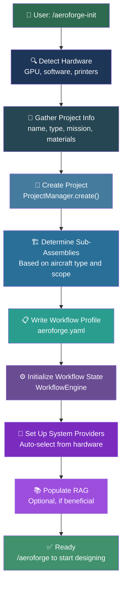
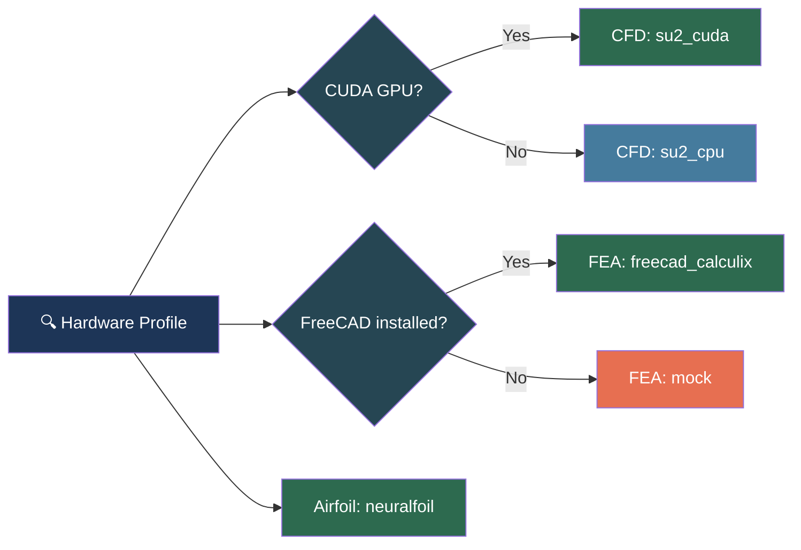

# Initialization and Project Profile

The `/aeroforge-init` skill creates a new AeroForge project through an interactive conversation. No CLI commands, no forms -- the LLM gathers information through natural language and sets everything up.

---

## Initialization Flow



---

## Step 1: Hardware Detection

The system scans the local machine before suggesting providers:

```python
from src.providers.hardware import detect_hardware
hw = detect_hardware()
print(hw.summary())
```

The `HardwareProfile` captures:

| Field | Description |
|-------|-------------|
| `gpu_type` | `nvidia_cuda`, `amd_rocm`, or `None` |
| `gpu_name` | e.g., "NVIDIA GeForce RTX 3070" |
| `gpu_vram_mb` | VRAM in megabytes |
| `cuda_available` | Boolean -- enables SU2 CUDA provider |
| `printers` | List of detected 3D printers (LAN/USB/cloud) |
| `installed_software` | Dict of analysis tools found (FreeCAD, Gmsh, SU2, etc.) |
| `os_platform` | Operating system identifier |

---

## Step 2: Project Information

The LLM gathers (or infers from context):

| Parameter | Description | Example |
|-----------|-------------|---------|
| **Project name** | Human-readable | "F5J Thermal Sailplane" |
| **Project slug** | Directory name | `air4-f5j` |
| **Mission prompt** | What and why | "Design a competitive F5J sailplane for under 100 EUR" |
| **Aircraft type** | Free-form string | "thermal sailplane", "interceptor drone", "paper airplane" |
| **Project scope** | `component`, `assembly`, or `aircraft` | `aircraft` |
| **Top object name** | Root of the node tree | "Iva_Aeroforge" |
| **Manufacturing technique** | Tooling/technique | "FDM 3D printing" |
| **Materials** | Material list | "LW-PLA, carbon tube, spruce strip" |

Aircraft type is a **free-form string**, not an enum. The only constraint: heavier-than-air and exposed to airflow.

---

## Step 3: Project Creation

`ProjectManager.create()` generates the project directory:

```
projects/
└── air4-f5j/
    ├── aeroforge.yaml          # Project config + provider selections
    ├── cad/
    │   ├── components/         # Individual pieces
    │   └── assemblies/         # Multi-piece assemblies
    ├── docs/                   # Project-specific documentation
    │   └── specifications.md
    └── exports/                # Generated artifacts
```

---

## Step 4: Sub-Assembly Determination

Based on aircraft type and scope, the LLM determines the component/assembly tree. Reference templates are available for inspiration but are not prescriptive:

```python
from src.orchestrator.aircraft_types import REFERENCE_TEMPLATES, list_types
print(list_types())  # Reference only -- modify freely
```

For a simple project (paper plane), there may be a single component. For a full aircraft, there are multiple levels of sub-assemblies.

---

## Step 5: Workflow Profile

The profile is written to `aeroforge.yaml` and defines the node tree:

```yaml
workflow_profile:
  aircraft_type: "thermal sailplane"
  project_scope: "aircraft"
  top_object_name: "Iva_Aeroforge"
  round_label: "R1"
  sub_assemblies:
    - name: "Wing_Assembly"
      level: 1
      analysis_scope: "aero_structural"
      dependencies: []
      deliverables: ["STEP", "3MF"]
    - name: "Empennage_Assembly"
      level: 1
      analysis_scope: "aero_structural"
      dependencies: []
      deliverables: ["STEP", "3MF"]
  validation_criteria:
    l_over_d_min: 15.0
    structural_sf_min: 1.5
    flutter_margin_min: 1.2
```

---

## Step 6: Workflow State Initialization

The workflow engine creates the initial state from the profile:

```python
from src.orchestrator.workflow_engine import WorkflowEngine
engine = WorkflowEngine()
state = engine.create_project_from_profile_file(config_path, project_name)
print(engine.get_workflow_summary())
```

This produces `workflow_state.json` with all nodes initialized at `AERO_PROPOSAL` / `pending`.

---

## Step 7: System Provider Setup

System providers are auto-selected based on detected hardware:



System providers are stored in `config/system_providers.yaml` and shared across all projects.

---

## Step 8: RAG Population (Optional)

If the project benefits from pre-fetched domain knowledge:

```python
from src.rag import populate_rag
populate_rag(project_code="AIR4", mission_prompt="F5J thermal sailplane")
```

This populates a ChromaDB vector store with competitive intelligence, construction techniques, and design references.

---

## Multi-Project Support

AeroForge supports multiple concurrent projects:

```python
from src.orchestrator.project_manager import ProjectManager
pm = ProjectManager()
pm.list_projects()     # Show all projects
pm.switch("air4-f5j")  # Switch active project
```

Each project has its own `aeroforge.yaml`, workflow state, CAD tree, and project-level providers. System-level providers (CFD, FEA, Airfoil) are shared.
