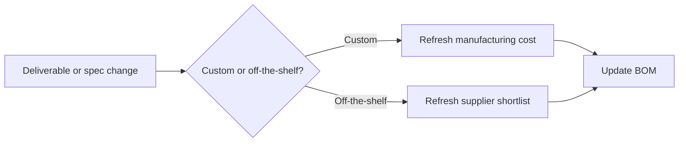

# Living BOM and Procurement

Canonical source:
[docs/framework/bom-and-procurement.md](https://github.com/ipanov/aeroforge/blob/master/docs/framework/bom-and-procurement.md)

The BOM is a living artifact. It updates when geometry, materials,
manufacturing assumptions, or off-the-shelf specifications change.

