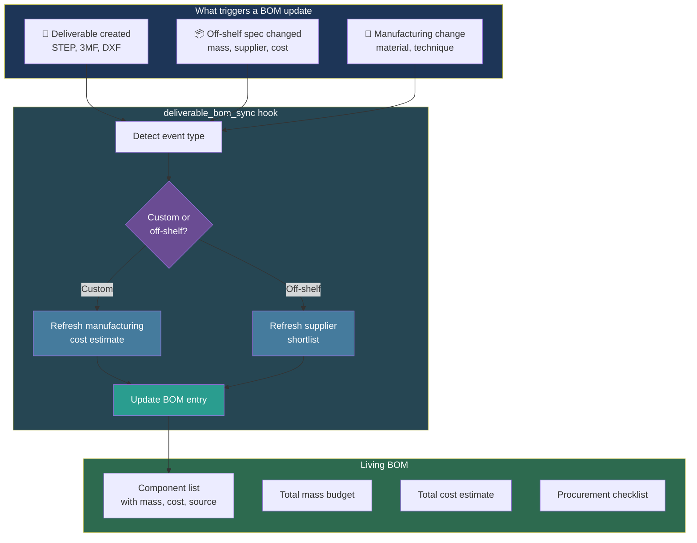

# Living BOM and Procurement

The Bill of Materials (BOM) is a **living artifact** -- it updates automatically whenever geometry, materials, manufacturing assumptions, or off-the-shelf specifications change. The `deliverable_bom_sync` hook keeps it in sync.

---

## BOM Update Flow

---

## BOM Entry Structure

Each BOM line item includes:

| Field | Description | Example |
|-------|-------------|---------|
| `name` | Component name | "Wing_Panel_P1" |
| `type` | `custom` or `off_shelf` | `custom` |
| `mass_g` | Mass in grams | 28.5 |
| `material` | Material specification | "LW-PLA" |
| `quantity` | How many needed | 2 (left + right) |
| `source` | Where to get it | "3D printed" or "supplier" |
| `cost_estimate` | Estimated cost | 2.50 EUR |
| `supplier` | Supplier name (off-shelf) | "HobbyKing" |
| `link` | Purchase link (off-shelf) | URL |
| `lead_time` | Shipping estimate | "2-3 weeks" |

---

## Procurement Strategy

The procurement hierarchy:

1. **Local suppliers** (Bulgaria) -- fastest delivery, highest priority
2. **Temu** -- good prices, reasonable shipping
3. **AliExpress** -- last resort (3-month customs delays possible)

For custom printed parts, the BOM tracks filament usage and print time estimates from the slicer provider.

---

## Automatic Sync

The `deliverable_bom_sync` PostToolUse hook fires on every deliverable creation or modification. It:

1. Detects which component/assembly was updated
2. Reads the component's mass, material, and manufacturing info
3. Updates or creates the BOM entry
4. Recalculates totals (mass budget, cost estimate)

This is fully automatic -- no manual BOM maintenance needed.
