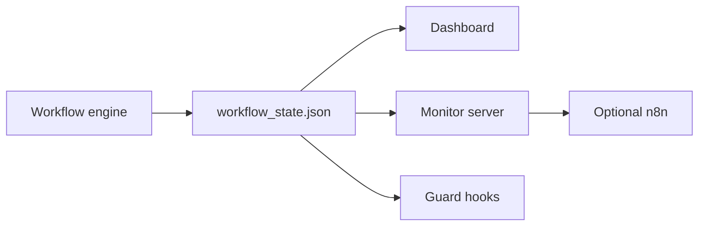

# Monitoring, Hooks, and n8n

Canonical source:
[docs/framework/monitoring-hooks-and-n8n.md](https://github.com/ipanov/aeroforge/blob/master/docs/framework/monitoring-hooks-and-n8n.md)

The persisted workflow state remains authoritative. `n8n` is an optional
visibility/runtime layer, not the sole source of truth.
