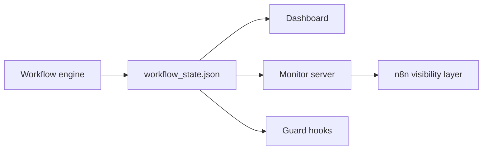

# Monitoring, Hooks, and n8n

Canonical source:
[docs/framework/monitoring-hooks-and-n8n.md](https://github.com/ipanov/aeroforge/blob/master/docs/framework/monitoring-hooks-and-n8n.md)

`n8n` is always started alongside the workflow monitor server. The persisted
workflow state remains the authoritative source of truth. If n8n becomes
unreachable, the engine continues without it.
