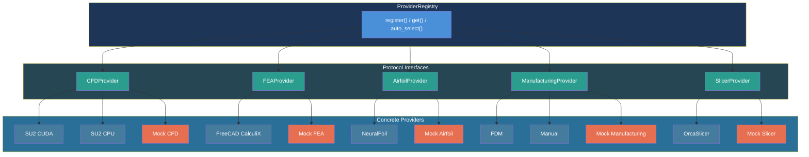
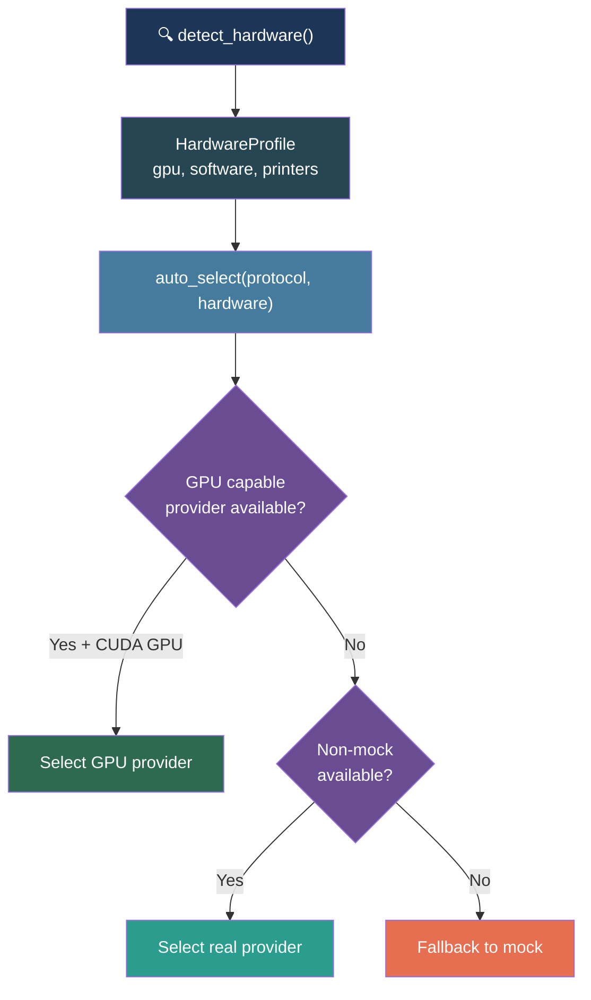

# Provider System

AeroForge uses a **provider abstraction** to decouple the workflow engine from specific analysis and manufacturing tools. Each provider category has a Protocol (interface), multiple implementations, and a registry that handles selection.

---

## Architecture



---

## System vs Project Providers

Providers are split into two levels:

| Level | Stored in | Depends on | Examples |
|-------|-----------|-----------|----------|
| **System** | `config/system_providers.yaml` | Local hardware (GPU, installed software) | CFD, FEA, Airfoil |
| **Project** | `projects/{slug}/aeroforge.yaml` | What is being built | Manufacturing, Slicer |

### Why the Split

System providers depend on what tools are installed on the machine. A user with an NVIDIA GPU gets `su2_cuda`; without one, they get `su2_cpu`. These are shared across all projects.

Project providers depend on the design. An FDM 3D-printed sailplane uses `fdm` + `orcaslicer`. A hand-built paper airplane uses `manual` + `mock`. Different projects on the same machine use different project providers.

---

## Provider Categories

### CFD (System Level)

| Provider ID | Class | Requires | Description |
|-------------|-------|----------|-------------|
| `su2_cuda` | `SU2CudaProvider` | NVIDIA GPU + SU2 | GPU-accelerated CFD (Euler, RANS, transition) |
| `su2_cpu` | `SU2CpuProvider` | SU2 | CPU-only CFD |
| `mock` | `MockCFDProvider` | Nothing | Returns synthetic data for testing |

### FEA (System Level)

| Provider ID | Class | Requires | Description |
|-------------|-------|----------|-------------|
| `freecad_calculix` | `FreeCADCalculixProvider` | FreeCAD 1.0+ | CalculiX solver via FreeCAD headless |
| `mock` | `MockFEAProvider` | Nothing | Returns synthetic data for testing |

### Airfoil (System Level)

| Provider ID | Class | Requires | Description |
|-------------|-------|----------|-------------|
| `neuralfoil` | `NeuralFoilProvider` | NeuralFoil package | Neural network airfoil polars |
| `mock` | `MockAirfoilProvider` | Nothing | Returns synthetic polars |

### Manufacturing (Project Level)

| Provider ID | Class | Description |
|-------------|-------|-------------|
| `fdm` | `FDMProvider` | FDM 3D printing (Bambu, Prusa, etc.) |
| `manual` | `ManualProvider` | Hand-built construction (balsa, paper, foam) |
| `mock` | `MockManufacturingProvider` | For testing |

### Slicer (Project Level)

| Provider ID | Class | Description |
|-------------|-------|-------------|
| `orcaslicer` | `OrcaSlicerProvider` | OrcaSlicer CLI for FDM |
| `mock` | `MockSlicerProvider` | For testing |

---

## Auto-Detection and Selection



The `ProviderRegistry` supports three selection modes:

1. **Explicit** -- `ProviderRegistry.get(protocol, "su2_cuda")` -- exact match or error
2. **Auto-select** -- `ProviderRegistry.auto_select(protocol, hardware)` -- best match for hardware
3. **Config-driven** -- `ProviderRegistry.resolve_from_config(protocol, yaml_config, category, hardware)` -- reads `selected` from YAML, falls back to auto

---

## ProviderInfo Metadata

Every provider registers metadata:

```python
@dataclass
class ProviderInfo:
    provider_id: str              # "su2_cuda"
    display_name: str             # "SU2 CUDA"
    protocol_type: type           # CFDProvider
    requires_gpu: bool            # True
    requires_software: list[str]  # ["su2"]
    description: str              # "GPU-accelerated CFD solver"
```

This metadata drives the auto-selection logic and the hardware report shown during `/aeroforge-init`.

---

## Adding a New Provider

1. Create a Protocol class in `src/providers/{category}/protocol.py` (if new category)
2. Implement the provider in `src/providers/{category}/{name}.py`
3. Register in the module's `__init__.py`:

```python
from .protocol import CFDProvider
from .my_solver import MySolverProvider
from ..base import ProviderRegistry, ProviderInfo

provider = MySolverProvider()
ProviderRegistry.register(
    CFDProvider,
    provider,
    ProviderInfo(
        provider_id="my_solver",
        display_name="My Solver",
        protocol_type=CFDProvider,
        requires_gpu=False,
        requires_software=["my_solver_binary"],
    ),
)
```

Providers register at import time. The registry is populated as soon as the package loads.
