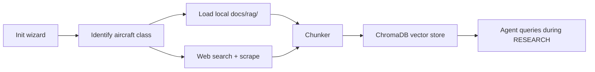

# RAG Knowledge Base

Canonical source:
[docs/framework/rag-knowledge-base.md](https://github.com/ipanov/aeroforge/blob/master/docs/framework/rag-knowledge-base.md)

After the initialization wizard, a ChromaDB-backed vector database is
populated with domain knowledge: similar aircraft, regulations, construction
techniques, and design references. Agents query it during the RESEARCH step
for semantic context before falling back to web searches.

- **Backend:** ChromaDB with PersistentClient (`.aeroforge/rag_db/`)
- **Embeddings:** sentence-transformers (all-MiniLM-L6-v2), local
- **Sources:** `docs/rag/` local files + web search results
- **Querying:** `from src.rag import query_rag`
