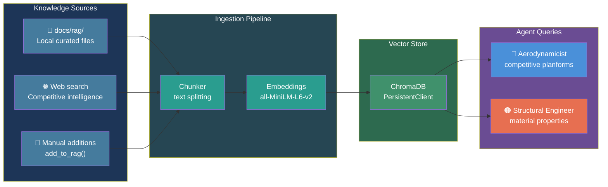

# RAG Knowledge Base

AeroForge includes an **optional** ChromaDB-backed vector database that agents can populate and query for domain-specific competitive intelligence.

---

## Architecture



---

## Stack

| Component | Technology | Notes |
|-----------|-----------|-------|
| **Vector store** | ChromaDB with PersistentClient | Stored in `.aeroforge/rag_db/` |
| **Embeddings** | sentence-transformers (all-MiniLM-L6-v2) | Runs locally, no API needed |
| **Sources** | `docs/rag/` local files + web search results | Curated + auto-fetched |

---

## Usage

```python
from src.rag import populate_rag, query_rag, add_to_rag

# Populate during RESEARCH step (agent decides when)
db = populate_rag(project_code="AIR4", mission_prompt="F5J thermal sailplane")

# Query during design decisions
results = query_rag("F5J planform taper ratio competition")

# Add a specific useful URL
add_to_rag("https://example.com/f5j-design-guide")
```

---

## Role Hierarchy

Agents should prefer knowledge sources in this order:

| Priority | Source | Speed | Use case |
|----------|--------|-------|----------|
| 1 | LLM built-in knowledge | Instant | Broad coverage, general expertise |
| 2 | RAG database | ~10ms | Pre-fetched competitive intelligence |
| 3 | `docs/rag/` curated files | Direct Read | Project-specific benchmarks |
| 4 | WebSearch | Real-time | Current or very specific data |
| 5 | WebFetch | Real-time | Known URLs with detailed content |

The RAG is a **pre-fetched cache of competitive intelligence** that agents can query fast during iterative design decisions. It is NOT a mandatory step and NOT a replacement for web search.

---

## Population

RAG population happens during `/aeroforge-init` (Step 8) or whenever the LLM decides more domain knowledge is needed. The agent:

1. Identifies relevant search queries based on aircraft type and mission
2. Runs web searches for competitive designs, construction techniques, regulations
3. Fetches and chunks the content
4. Embeds and stores in ChromaDB

Population is **agent-driven** -- the LLM decides what to search for based on the project context, not a hardcoded list.
