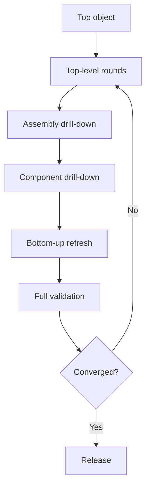

# Workflow and Iteration Model

Canonical source:
[docs/framework/workflow.md](https://github.com/ipanov/aeroforge/blob/master/docs/framework/workflow.md)

## Stage Sequence

```mermaid
flowchart LR
    A[REQUIREMENTS] --> B[RESEARCH]
    B --> C[AERO_PROPOSAL]
    C --> D[STRUCTURAL_REVIEW]
    D --> E[AERO_RESPONSE]
    E --> F[CONSENSUS]
    F --> G[DRAWING_2D]
    G --> H[MODEL_3D]
    H --> I[MESH]
    I --> J[VALIDATION]
    J --> K[RELEASE]
```

## Iteration Loop

```mermaid
flowchart TD
    A[Top object] --> B[Top-level rounds]
    B --> C[Assembly drill-down]
    C --> D[Component drill-down]
    D --> E[Bottom-up refresh]
    E --> F[Full validation]
    F --> G{Converged?}
    G -- No --> B
    G -- Yes --> H[Release]
```
